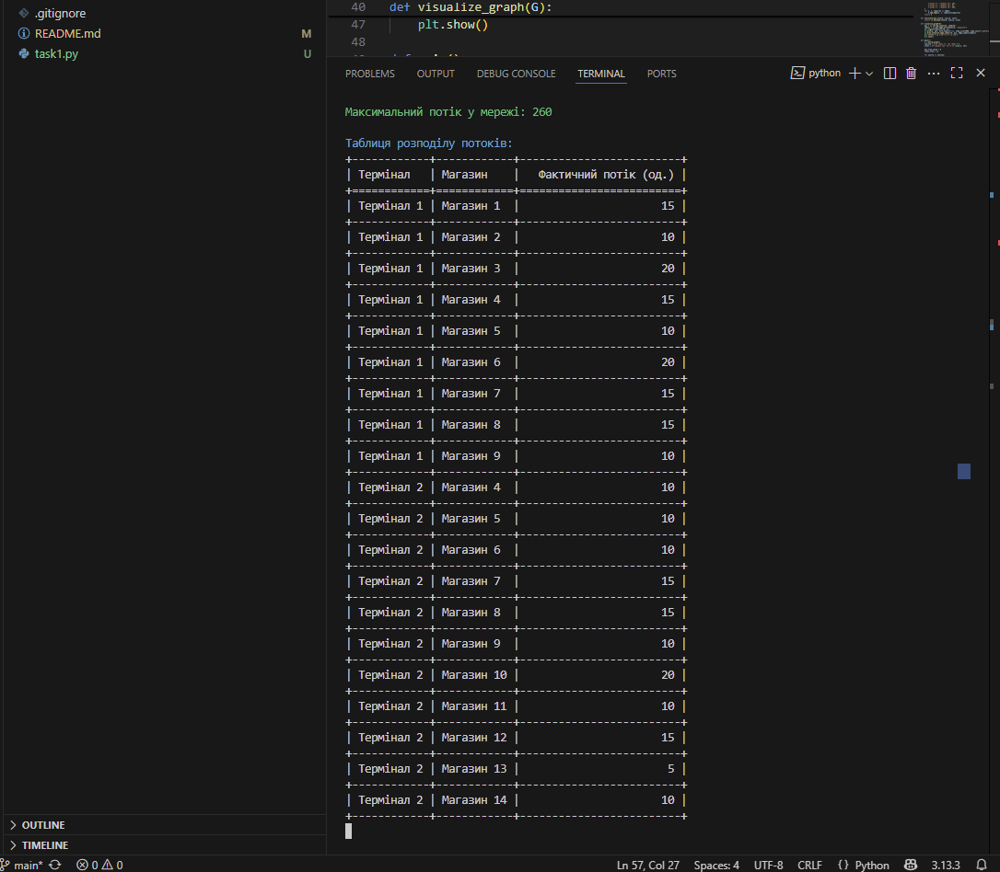

# Домашнє завдання до теми «Графи та дерева»

# Завдання 1. Застосування алгоритму максимального потоку для логістики товарів

Розробіть програму для моделювання мережі потоків для логістики товарів зі
складів до магазинів, використовуючи алгоритм максимального потоку. Проведіть
аналіз отриманих результатів і порівняйте їх з теоретичними знаннями.

---

## Опис завдання

Побудуйте модель графа, що представляє мережу потоків у наступному зображені:

Зв'язки та пропускні здатності у графі мають наступний вигляд:

| Від        | До         | Пропускна здатність (одиниць) |
| ---------- | ---------- | ----------------------------- |
| Термінал 1 | Склад 1    | 25                            |
| Термінал 1 | Склад 2    | 20                            |
| Термінал 1 | Склад 3    | 15                            |
| Термінал 2 | Склад 3    | 15                            |
| Термінал 2 | Склад 4    | 30                            |
| Термінал 2 | Склад 2    | 10                            |
| Склад 1    | Магазин 1  | 15                            |
| Склад 1    | Магазин 2  | 10                            |
| Склад 1    | Магазин 3  | 20                            |
| Склад 2    | Магазин 4  | 15                            |
| Склад 2    | Магазин 5  | 10                            |
| Склад 2    | Магазин 6  | 25                            |
| Склад 3    | Магазин 7  | 20                            |
| Склад 3    | Магазин 8  | 15                            |
| Склад 3    | Магазин 9  | 10                            |
| Склад 4    | Магазин 10 | 20                            |
| Склад 4    | Магазин 11 | 10                            |
| Склад 4    | Магазин 12 | 15                            |
| Склад 4    | Магазин 13 | 5                             |
| Склад 4    | Магазин 14 | 10                            |

Застосуйте алгоритм максимального потоку для вирішення задачі. Напишіть
програму, що реалізує алгоритм Едмондса-Карпа, або скористайтеся вже
реалізованою версією для знаходження максимального потоку в побудованому графі.
Проведіть аналіз отриманого результату. Чи досягнуто оптимального потоку, і що
це означає для розглянутої мережі?

Після отримання таблиці дайте відповідь на наступні запитання:

1. Які термінали забезпечують найбільший потік товарів до магазинів?

2. Які маршрути мають найменшу пропускну здатність і як це впливає на загальний
   потік?

3. Які магазини отримали найменше товарів і чи можна збільшити їх постачання,
   збільшивши пропускну здатність певних маршрутів?

4. Чи є вузькі місця, які можна усунути для покращення ефективності логістичної
   мережі?

---   

# Завдання 2. Порівняння ефективності OOBTree і словника для діапазонних запитів

Розробіть програму для зберігання великого набору даних про товари у двох
структурах даних — `OOBTree` та `dict` — і проведіть порівняльний аналіз їхньої
продуктивності для виконання діапазонних запитів.

## Опис завдання

---

1. Використовуйте запропонований файл `generated_items_data.csv` для
   завантаження інформації про товари. Кожен товар включає унікальний
   ідентифікатор `ID`, назву `Name`, категорію `Category` та ціну `Price`.

2. Реалізуйте дві структури для зберігання товарів. Першу — `OOBTree` з
   бібліотеки `BTrees`, де ключем є `ID`, а значенням — словник із атрибутами
   товару. Другу — `dict` (стандартний словник), де ключем також є `ID`, а
   значенням — аналогічний словник із атрибутами товару.

3. Створіть функції для додавання товарів у обидві структури: `add_item_to_tree`
   та `add_item_to_dict`.

4. Створіть функції для виконання діапазонного запиту, де потрібно знайти всі
   товари у визначеному діапазоні цін: `range_query_tree` та `range_query_dict`.

5. Виміряйте загальний час виконання діапазонного запиту для кожної структури,
   використовуючи `timeit`.

6. Для кожної структури виконайте діапазонний запит 100 разів, щоб обчислити
   середній час виконання.

7. Виведіть загальний час виконання діапазонного запиту для кожної структури,
   зокрема, скільки часу займає виконання 100 запитів для `OOBTree` та `dict`.

## Результат 

#### Завдання 1

1. Термінал 2 забезпечує найбільший потік товарів до магазинів.
2. Найменшу пропускну здатність мають маршрути до Магазину 13 (5 од.) та Магазину 14 (10 од.), що обмежує загальний потік.
3. Найменше товарів отримали Магазини 13 та 14; їх постачання можна збільшити, підвищивши пропускну здатність маршрутів від Складу 4.
4. Вузькими місцями є маршрути зі Складу 4 до Магазинів 13 і 14; збільшення їх пропускної здатності підвищить ефективність мережі.

#### Завдання 2

